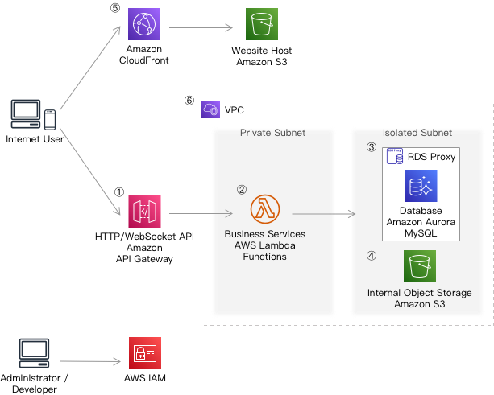

# AWS Architecture Design Assignment

  The architecture is designed to achieve manageable, secure, scalable, high performance, efficient, elastic, highly available, fault tolerant and recoverable for a rapid growing company.

## Requirement Analysis

### Heterogeneous Services

  The applications were developed by different programming languages.

  * Golang is their next-gen programming language for the new applications.
  * NodeJS applications and Java applications are the currently running applications that will exist in a period of time.

### Auto Scaling on Demand

  The demand of infrastructure is unpredictable. They are uncertainty around when and how much the demand will be. On the other hand, they are very concerned about buying too much infrastructure too soon or not enough too late. So the infrastructure should auto scale on demand, and pay attention to the cost.

### Auto Data Recovery

  Currently they use MySQL database cluster. They can configure the database and data access layer for high performance and throughput, but lack of provision for Disaster Recovery. The data should be backed up and recovered automatically in case of outage.

### Low Latency of User Experience

  To improve the user experience, the latency time should be very low, even though a large portion of their user base will be from far away.

### Effective Load Distribution

  The distribution of load should be self-healing when service instances recovered from failure.

### Security

  * Data security: security of data at rest and in transit
  * Management security: securing access to the environment

### Archiving

  Archive inactive objects greater than 6 months.

### Management and Replication of Architecture Easily

  They can easily manage and replicate multiple environments based on their blueprint architecture.

## Architectural Design



  The architecture is a micro-services architecture to support heterogeneous services.

1: HTTP / WebSocket API

  Use Amazon API Gateway to expose HTTP / WebSocket APIs to Internet.

  Amazon API Gateway is used for creating, publishing, maintaining, monitoring, and securing REST, HTTP, and WebSocket APIs at any scale. It acts as a "front door" for backend services. API Gateway also protects data in transit and at rest.

  Used AWS Service:

  * Amazon API Gateway

2: Business Service

  The business service is developed using Golang, and deployed as AWS Lambda functions.

  AWS Lambda performs the necessary execution and administration of computing resources. It scales automatically, and there is no charge when the code is not running. Additionally, Lambda uses a safety throttle for the number of concurrent executions. Thus, the cost of infrastructure can be controlled within a reasonable range.

  Used AWS Service:

  * AWS Lambda

3: Database

  To compatible with the applications and MySQL currently used, we use Amazon Aurora MySQL as database.

  The Lambda functions interact with RDS Proxy instead of database instance. By using Amazon RDS Proxy, the database connection is pooled and shared between lambda functions to improve their ability to scale. RDS Proxy also enforces AWS Identity and Access Management (IAM) authentication for databases, and securely store credentials in AWS Secrets Manager.

  An Amazon Aurora DB cluster consists of one Primary DB instance and multiple Aurora Replicas that located in different Availability Zones. Each Aurora Replica have a copy of the DB cluster data. The data recovery is automatically. When the primary DB instance becomes unavailable, Amazon Aurora automatically fails over to an Aurora Replica.

  To handle unpredicted workload, we enable Aurora Auto Scaling of Aurora DB cluster. When the workload decreases, Aurora Auto Scaling removes unnecessary Aurora Replicas so that we don't pay for unused provisioned DB instances.

  Used AWS Service:

  * Amazon RDS Proxy
  * Amazon Aurora MySQL

4: Internal Object Storage

  Amazon S3 is used to store internal object such as files. The Amazon S3 Lifecycle can be configured to archive inactive objects greater than 6 months.

  Used AWS Service:

  * Amazon S3

5: Static Website

  The static website is hosted in Amazon S3 buckets to assumes the workload of static content. To reduce the latency and improve the user experience, use Amazon CloudFront to accelerate the static contents. Amazon S3 bucket acts as the origin server of Amazon CloudFront.

  Amazon CloudFront is a web service that speeds up distribution of static and dynamic web content to users. When a user requests content, the request is routed to the edge location that provides the lowest latency, so that content is delivered with the best possible performance and improved the user experience.

  Used AWS Service:

  * Amazon CloudFront
  * Amazon S3

6: Security

  To protect the business data (including database and internal storage) from malicious access, use VPC to control network traffic.

  By using AWS Identity and Access Management, administrators can control who can be authenticated (signed in) and authorized (have permissions) to use or manage AWS resources.

  Used AWS Service:

  * Amazon Virtual Private Cloud (VPC)
  * AWS Identity and Access Management (IAM)

## Run

1. ```cdk bootstrap aws://unknown-account/unknown-region``` populate an environment with resources required by the CDK to perform deployments into that environment
2. Enable or disable debug mode: edit file ```cdk.json```, set ```context.debug``` true to enable debug mode which force remove the bucket and database when data exists
3. ```cdk deploy --all``` deploy stacks to the default AWS account/region
